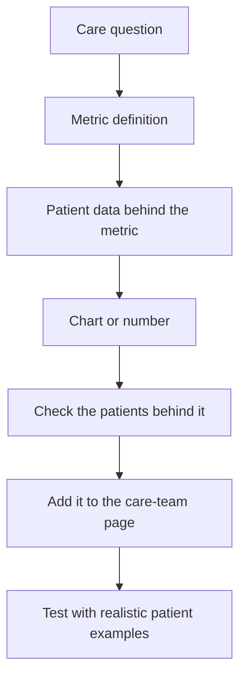

# Create analytics and charts

Use this when the app should show trends, completion rates, care gaps, quality measures, or patient lists behind a number.

Good analytics examples:

- vital sign trends
- PROMs score trends
- questionnaire completion rate
- missed follow-up count
- patients needing attention
- care gap lists

## Typical Chart-Building Flow



## Define The Question

Start with the decision the chart supports.

```text
Add analytics for [care question]. The chart should help [person] decide [decision].
```

Example:

```text
Add analytics for PROMs follow-up. The chart should help the care manager see completion rate, missed questionnaires, and patients with worsening scores.
```

## Ask For The Metric Definition

A metric should say what counts and what does not.

```text
Define the metric in plain language. Show what is counted, time period, patient group, and any excluded records.
```

Example:

```text
Completion rate means submitted two-week follow-up questionnaires divided by expected two-week follow-up questionnaires for orthopedic surgery patients in the selected date range.
```

## Say What Patient Data Feeds The Chart

Tell Atomic Workspace which patient records the chart should use.

```text
Use submitted PROMs follow-up forms as the source for this chart. Show submitted date, patient, score, status, and reason for review behind the chart.
```

For vital signs, say which measurements and units matter:

```text
Use blood pressure, heart rate, oxygen saturation, temperature, weight, and pain score. Keep units visible in the chart and the patient list behind it.
```

## Ask For Filters

Useful filters are usually simple:

- date range
- clinic
- provider
- patient group
- status

Ask:

```text
Add filters for date range, clinic, provider, patient group, and status.
```

## Include Patient Drill-Down

A chart is more useful when the care team can open the patients behind it.

```text
Each chart or metric should let the user open the patient list behind the number. The list should show patient, status, reason, and next action.
```

## Try The Chart With Real Cases

Ask for data that proves the chart is useful:

```text
Show the chart with normal, missed, and needs-attention patient examples. Confirm the totals match the patient list behind the chart.
```

Next, see [Create forms](create-forms.md) or [Create care workflows](create-care-workflows.md).
