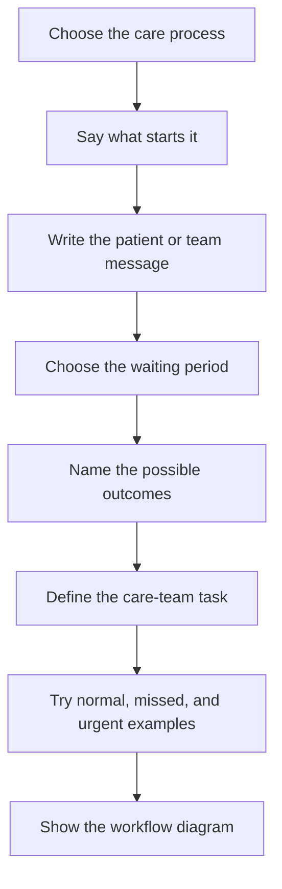

# Create care workflows

Use this when the app should wait, follow up, create a task, or move a patient to the top of a review list.

Good workflow examples:

- post-discharge follow-up
- missed questionnaire follow-up
- medication-change check-in
- abnormal result review
- care plan follow-up

## Typical Workflow-Building Flow



## Describe The Trigger

Say what starts the workflow.

```text
Create a care workflow that starts when [event happens].
```

Examples:

```text
Create a care workflow that starts when a patient is discharged.
```

```text
Create a care workflow that starts when a patient submits a concerning questionnaire response.
```

## Describe The Waiting Step

Say what the app waits for and how long.

```text
Wait for [patient action] until [time]. If it does not happen, mark the follow-up as missed.
```

Example:

```text
Wait for the patient to complete the Day 3 check-in. If it is not completed by the end of Day 3, mark it missed.
```

## Describe What The Care Team Sees

Ask for a list that shows work in the right order.

```text
Add a care-team list for this workflow. Put patients needing attention first, missed follow-ups second, and normal completed follow-ups last. Each row should show the reason and next action.
```

## Include The End States

A workflow should not end in a vague status.

Ask for clear outcomes:

```text
Use these outcomes: completed, missed, needs attention, and escalated. Show the reason for each outcome.
```

## Try The Workflow With Patient Examples

Ask Atomic Workspace to show the workflow with three patients:

```text
Show this workflow with three patient examples: completed follow-up, missed follow-up, and concerning response. Show what the care team sees for each one.
```

## Show The Workflow Diagram

Use a diagram when the care process is hard to understand from a list alone.

```text
Show a workflow diagram for this care process. The diagram should show start, patient action, waiting step, missed path, needs-attention path, completed path, and care-team task.
```

For a running follow-up, ask where the patient is now:

```text
When viewing a patient, show where that patient is in the workflow diagram now and what the next step is.
```

Do not ask for a separate drawing that can drift away from the app:

```text
Make the diagram reflect the actual workflow in the app. If the workflow changes, the diagram should change with it.
```

Next, see [Create copilots](create-copilots.md) or [Create forms](create-forms.md).
