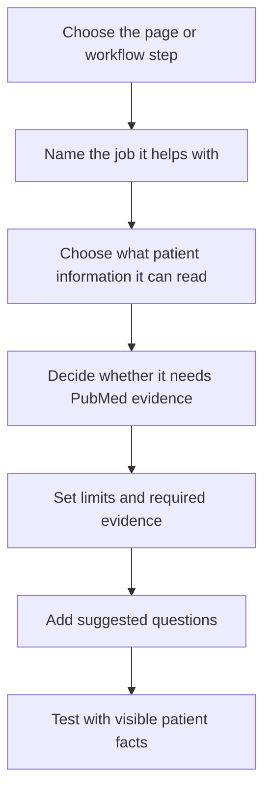

# Create copilots

Use this when the app should help a clinician or care team understand patient context, submitted answers, evidence, or the next care step.

Good copilot examples:

- summarize a submitted questionnaire
- explain why a patient needs attention
- compare patient facts with PubMed literature
- draft a note from structured form answers
- help a care workflow decide what should happen next

## Typical Copilot-Building Flow



## Choose Where The Copilot Lives

Put the copilot next to the work it helps with.

```text
Add a copilot to [page or task]. It should help [user] with [specific job].
```

Example:

```text
Add a copilot to the questionnaire review page. It should help nurses understand the latest response and decide whether the patient needs follow-up.
```

## Choose How It Is Used

Use a chat copilot when the clinician needs to ask questions while reviewing a patient.

Use it inside a care workflow when the app needs one structured answer, such as a summary, reason, suggested next action, and safety limitation.

## Say What It Can Read

Name the information the copilot should use.

```text
The copilot should use [patient facts, submitted form answers, recent vitals, medications, conditions, care-team notes, or chart data].
```

Example:

```text
The copilot should use the patient demographics, latest PHQ-9 response, previous PHQ-9 scores, current medications, active conditions, and recent care-team notes.
```

## Require Evidence In The Answer

A useful clinical copilot should show what it used.

```text
For every answer, show the patient facts used and mark any missing information. Do not invent facts that are not visible in the app.
```

For literature-backed answers, ask for PubMed:

```text
When answering evidence questions, use PubMed literature with visible citations. Keep PubMed sources separate from patient facts.
```

## Keep The Copilot In Its Lane

Say what the copilot should not do.

```text
The copilot should summarize, explain, and suggest questions for review. It should not make final clinical decisions or change patient data without confirmation.
```

## Add Suggested Questions

Give users useful starting questions.

```text
Add suggested questions: Why does this patient need attention? What changed since the last response? What patient facts support this status? What information is missing?
```

## Use A Copilot In A Care Workflow

For workflows, a copilot can help classify or explain a step.

```text
In the follow-up workflow, use a copilot to review the patient's latest response and return a summary, reason for status, suggested next action, and any safety limitations.
```

The care team should still see the reason and make the final decision.

## Try The Copilot

Test it with questions you can verify from the app.

```text
Show the copilot answering: Why does this patient need attention? List only facts visible in the app and any PubMed sources used.
```

Next, see [Create care workflows](create-care-workflows.md) or [Create analytics and charts](create-analytics-and-charts.md).
