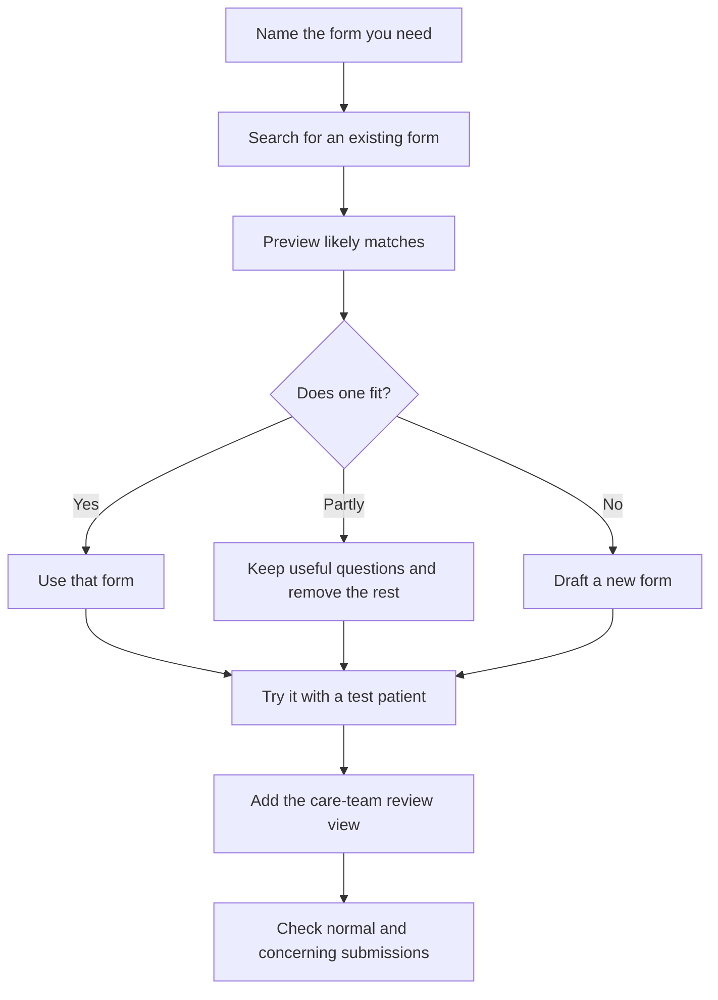

# Create forms

Use this when your app needs intake, a screener, a survey, a symptom check-in, consent, or a patient-reported outcome form.

## Typical Form-Building Flow

This is the flow for creating a form in your project.



## Start With An Existing Form

If your team already uses a questionnaire, ask Atomic Workspace to look for it first.

```text
Look for an existing [form name] questionnaire. Show likely matches before adding one to the project.
```

If a form is close but too broad, ask to adapt it:

```text
Use the useful questions from this form, but remove sections that are not part of this visit.
```

For PROMs, screeners, and clinic-approved forms, reuse matters more than speed.

## Ask For A Custom Form

Name who fills it, when they fill it, and who reviews it.

```text
Create a patient form for [care task].

Patients should answer [fields]. The care team should review the submitted answers in [place in the app].
```

Example:

```text
Create a two-week surgery follow-up form.

Patients should answer pain score, mobility, wound concern, medication side effects, overall recovery, and free-text concern. Nurses should review submitted answers from a follow-up list.
```

## Include The Care-Team Review Page

A form is incomplete if nobody can review the answers.

Ask for:

```text
Add a care-team review page for submitted answers. Show patient, date submitted, answers, missing required answers, status, and the reason for status.
```

Good status reasons are plain:

- completed
- missed
- worsening pain
- wound concern
- side effects reported
- missing required answer

## Keep Patient Wording Plain

Ask for patient language and care-team language separately.

```text
Use plain language for patient questions. Use clinical labels only on the care-team review page.
```

Example:

```text
Ask patients "Is your pain worse than when you left the hospital?" Show the care-team label as "worsening pain".
```

## Try Two Submissions

After the form appears, try one normal answer and one answer that needs attention.

Ask:

```text
Show one normal submitted form and one submitted form that needs attention. Make the reason visible in the care-team review page.
```

Next, see [Create care workflows](create-care-workflows.md) or [Create analytics and charts](create-analytics-and-charts.md).
