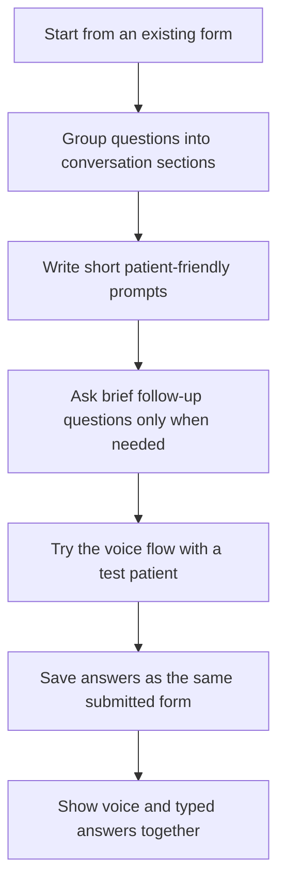
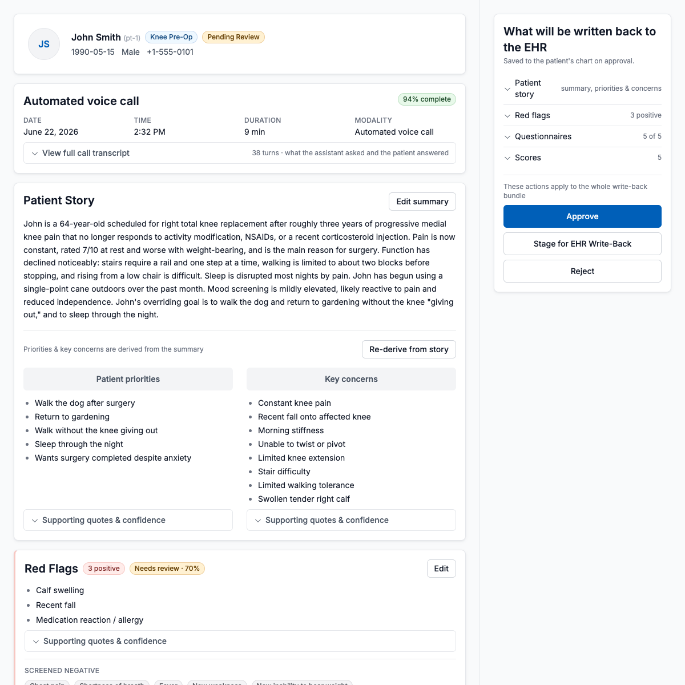

# Create voice agents

Use this when a patient should answer an existing form by talking instead of typing.

Voice works best for short, focused forms. Start with the form first, then add voice.

## Typical Voice-Building Flow



## Start From A Form

Ask for the form before asking for voice.

```text
First create the [form name] form. Then add a voice agent that helps the patient complete that same form.
```

Example:

```text
First create the post-discharge check-in form. Then add a voice agent that helps the patient complete that same check-in by talking.
```

## Design The Conversation From The Form

The voice agent should follow the form, but it should not sound like someone reading a form aloud.

Ask:

```text
Group the form questions into short conversation sections. Keep the important clinical sections, skip display-only text, and ask only questions the patient can answer.
```

## Keep The Voice Agent Focused

The voice agent should not interview the patient about everything.

Ask:

```text
The voice agent should ask only the questions needed for this form. Keep the conversation short, use patient-friendly wording, and ask brief follow-up questions only when a required answer is missing.
```

## Match The Written Form

The voice answer should become the same kind of submitted form answer.

Ask:

```text
Save the voice answers as a submitted form response. The care team should review voice and typed submissions in the same review page.
```

A good voice result ends as a reviewable care-team screen, not as a separate call artifact.



## Add Review Before Submit

For patient safety, give the patient a chance to check the answers.

```text
Let the patient review the answers before submitting. Do not submit if required answers are missing.
```

## Try The Voice Agent

Try it with a normal case and one case that needs attention.

```text
Show a voice test for one normal patient and one patient with worsening symptoms. After each test, show the submitted response in the care-team review page.
```

Next, see [Create forms](create-forms.md) or [Create copilots](create-copilots.md).
